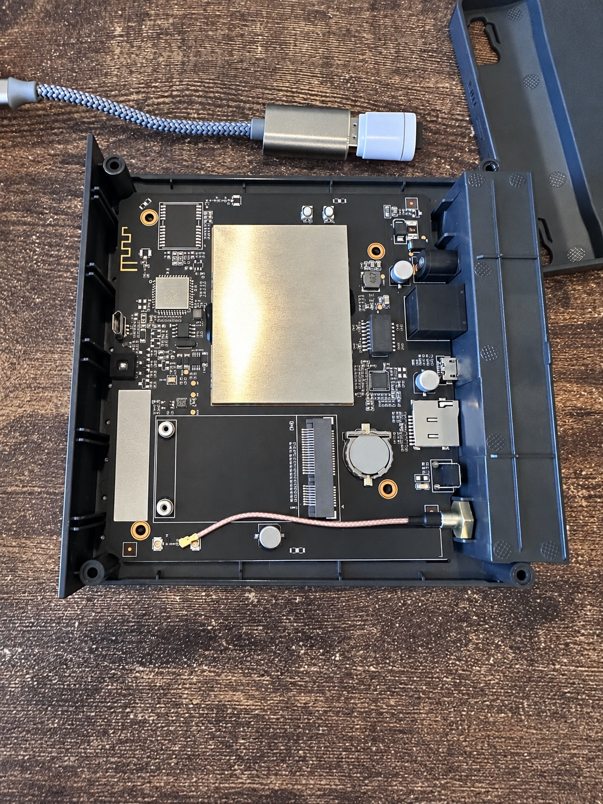
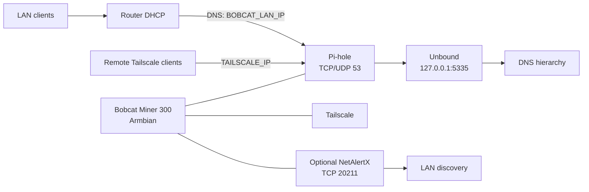
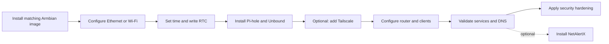

# Bobcat Miner DNS Appliance

Turn a supported Bobcat Miner 300 into a small home-network appliance running:

- Armbian Linux
- Pi-hole for network-wide DNS filtering
- Unbound as a local recursive DNS resolver
- Tailscale for secure remote access and remote DNS filtering
- Chrony for reliable time synchronization
- Optional NetAlertX for LAN device discovery and change monitoring



The goal is practical: reuse inexpensive hardware that is otherwise sitting idle instead of buying a new single-board computer.

The exact board and boot method depend on the Bobcat revision. Use the matching Armbian image before continuing.

## What you need

### Minimum

- A Bobcat model supported by the [Bobcat-Armbian project](https://github.com/sicXnull/Bobcat-Armbian)
- A reliable 16 GB or larger microSD card
- A computer with an SD-card writer
- The Bobcat power supply
- A network connection

### Recommended

- 32 GB or larger high-endurance microSD card
- Ethernet for first boot and initial configuration
- A DHCP reservation or static LAN address
- A second computer for SSH administration

## Supported hardware

Bobcat revisions are not interchangeable. Confirm the model printed on the device and use the matching image from the [upstream project](https://github.com/sicXnull/Bobcat-Armbian).

| Variant | Boot method | Notes |
| --- | --- | --- |
| G280 | microSD | Supported upstream; not tested by this repository. The upstream guide lists this variant as Wi-Fi-free. |
| G285 | microSD | Tested by this repository; internal eMMC can remain untouched. |
| G290 | eMMC flasher image | Supported upstream; not tested by this repository. The matching image writes Armbian to internal eMMC. |
| G295 | eMMC flasher image | Supported upstream; not tested by this repository. The matching image writes Armbian to internal eMMC. |

If your model is not listed, verify it upstream before flashing anything. Do not use a G280/G285 SD image on a G290/G295, or a G290/G295 flasher image on an SD-boot model.

## What the finished system does

```text
LAN clients
   |
   v
Bobcat 300
BOBCAT_LAN_IP
   |
   +--> Pi-hole :53
   |      |
   |      v
   |   Unbound 127.0.0.1:5335
   |      |
   |      v
   |   authoritative DNS hierarchy
   |
   +--> Tailscale TAILSCALE_IP
   |      |
   |      +--> remote devices can use the same Pi-hole
   |
   +--> optional NetAlertX :20211
          |
          +--> LAN device discovery and change monitoring

Armbian ramlog: /var/log on zram -> /var/log.hdd persistent backing storage
```

The router can continue to provide DHCP. Configure it to hand out the Bobcat as the primary DNS server.



## Installation path

1. [Install the correct Armbian image](docs/01-armbian-install.md).
2. [Connect the Bobcat by Ethernet or Wi-Fi](docs/02-networking.md).
3. [Set up time and the RTC](docs/05-time-and-rtc.md).
4. [Install Pi-hole and Unbound](docs/03-pihole-unbound.md).
5. [Add Tailscale](docs/04-tailscale.md) if remote DNS is wanted.
6. [Point the router and clients at Pi-hole](docs/06-router-and-clients.md).
7. [Validate the installation](docs/07-validation-maintenance.md).
8. [Apply final security hardening](docs/11-security-hardening.md).



Optional operations:

- [NetAlertX LAN monitoring](docs/08-netalertx.md)
- [Armbian RAM-backed logging](docs/09-storage-and-ramlog.md)
- [Troubleshooting and time/RTC recovery](docs/10-troubleshooting.md)

## Quick start

Use the numbered documents above. The DNS service is complete after Pi-hole and Unbound; Tailscale, NetAlertX, and storage tuning are optional additions. Do not skip time setup before installing services that depend on HTTPS or TLS. Apply the security-hardening guide after the appliance is working and validated so firewall changes do not complicate initial setup.

## Replace these placeholders

```text
BOBCAT_LAN_IP      replace with the Bobcat's LAN address
BOBCAT_LAN_CIDR    replace with the Bobcat's LAN address and prefix
ROUTER_LAN_IP      replace with the router/gateway address
TAILSCALE_IP       replace with `tailscale ip -4` output
DNS_HOSTNAME       replace with the hostname you choose
WIFI_PROFILE       replace with your NetworkManager Wi-Fi profile name
```

For example, after replacing the placeholders on one installation, commands might look like this:

```text
BOBCAT_LAN_IP      192.0.2.25
BOBCAT_LAN_CIDR    192.0.2.25/24
ROUTER_LAN_IP      192.0.2.1
TAILSCALE_IP       100.64.0.10
DNS_HOSTNAME       bobcat-dns
WIFI_PROFILE       Home Wi-Fi
```

These values are examples only. Use the addresses, hostname, and Wi-Fi profile from your own network. Do not copy this example block into a live configuration unchanged.

Do not commit real credentials, Wi-Fi SSIDs/passwords, MAC addresses, Tailscale state, private hostnames, or personal infrastructure names.

## Important notes

- Keep the Bobcat on a stable static IP or DHCP reservation.
- The router can continue handling DHCP; Pi-hole does not need to become the DHCP server.
- Do not expose TCP/UDP port 53 directly to the public internet.
- Tailscale provides the secure remote path instead.
- If the Bobcat boots with a wildly incorrect date, HTTPS/TLS and Tailscale can fail. The Chrony section addresses this.
- Back up configuration files before changing them.
- Do not install a separate Log2Ram service on this Armbian build; Armbian already provides RAM-backed/compressed logging through `armbian-ramlog`.
- NetAlertX is optional and should be reachable only over trusted LAN/Tailscale paths.

## Optional NetAlertX install

```bash
git clone https://github.com/CocoHusky/bobcat300-dns.git
cd bobcat300-dns
sudo bash scripts/install-netalertx.sh
```

Then open `http://BOBCAT_LAN_IP:20211` or `http://TAILSCALE_IP:20211` after substituting your own values.

## Final validation

```bash
hostname
ip -br addr
pihole status
systemctl is-active unbound
chronyc tracking
tailscale status
tailscale ip -4
ss -lntup | grep -E '(:53 |:5335 )'
```

Test Unbound directly:

```bash
dig @127.0.0.1 -p 5335 dnssec.works +dnssec
```

Test Pi-hole using your Bobcat LAN address:

```bash
dig @BOBCAT_LAN_IP google.com +short
dig @BOBCAT_LAN_IP doubleclick.net +short
```

## Scope

This project covers supported Bobcat Miner 300 revisions and their documented boot methods. Hardware expansion experiments and unrelated configurations are outside its scope.

## License

This repository's documentation and scripts are licensed under the [MIT License](LICENSE). Armbian images and the Pi-hole, Unbound, Tailscale, and NetAlertX projects are separate projects with their own licenses and terms.
