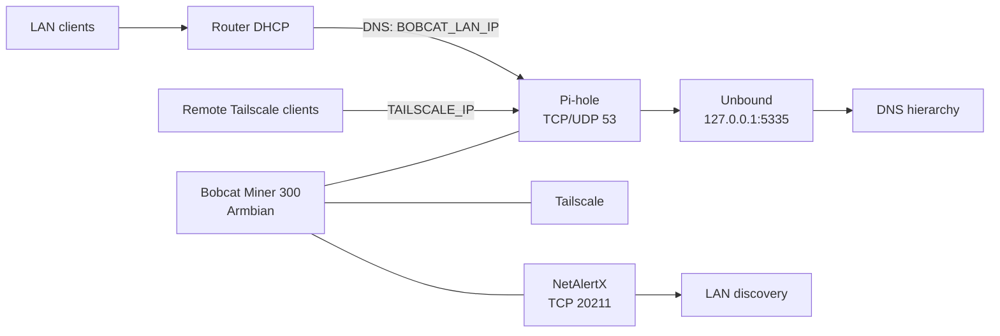
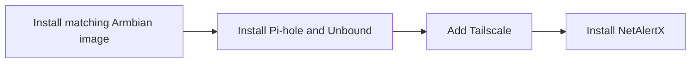

# Bobcat Miner DNS Appliance

Turn a supported Bobcat Miner 300 into a small home-network appliance running:

- Armbian Linux
- Pi-hole for network-wide DNS filtering
- Unbound as a local recursive DNS resolver
- Tailscale for secure remote access and remote DNS filtering
- Chrony for reliable time synchronization
- NetAlertX for LAN device discovery and change monitoring


The goal is practical: reuse inexpensive hardware that is otherwise sitting idle instead of buying a new single-board computer.

The exact board and boot method depend on the Bobcat revision. Use the matching Armbian image before continuing.

## What you need

### Minimum

- A Bobcat model supported by the [Bobcat-Armbian project](https://github.com/sicXnull/Bobcat-Armbian)
- A reliable 16 GB or larger microSD card
- A computer with an SD-card writer
- The Bobcat power supply
- A network connection

### Recommended

- 32 GB or larger high-endurance microSD card
- Ethernet for first boot and initial configuration
- A DHCP reservation or static LAN address
- A second computer for SSH administration

## Supported hardware

Bobcat revisions are not interchangeable. Confirm the model printed on the device and use the matching image from the [upstream project](https://github.com/sicXnull/Bobcat-Armbian).

| Variant | Boot method | Notes |
| --- | --- | --- |
| G280 | microSD | Supported upstream; not tested by this repository. The upstream guide lists this variant as Wi-Fi-free. |
| G285 | microSD | Tested by this repository; internal eMMC can remain untouched. |
| G290 | eMMC flasher image | Supported upstream; not tested by this repository. The matching image writes Armbian to internal eMMC. |
| G295 | eMMC flasher image | Supported upstream; not tested by this repository. The matching image writes Armbian to internal eMMC. |

If your model is not listed, verify it upstream before flashing anything. Do not use a G280/G285 SD image on a G290/G295, or a G290/G295 flasher image on an SD-boot model.

## What this builds

LAN and Tailscale clients use Pi-hole on the Bobcat for filtered DNS. Pi-hole forwards locally to Unbound for recursive resolution. The router can continue to provide DHCP.



## Core setup

1. [Install the correct Armbian image](docs/01-armbian-install.md).
2. [Install Pi-hole and Unbound](docs/03-pihole-unbound.md).
3. [Add Tailscale](docs/04-tailscale.md).
4. [Install NetAlertX](docs/08-netalertx.md).



## Supporting guides

These guides contain useful setup, maintenance, and recovery details outside the four core steps:

- [Networking](docs/02-networking.md) — Ethernet, Wi-Fi, and stable addressing.
- [Time and RTC setup](docs/05-time-and-rtc.md) — complete before Tailscale if the clock is incorrect.
- [Router and client DNS](docs/06-router-and-clients.md) — point the home network at Pi-hole.
- [Validation, maintenance, and recovery](docs/07-validation-maintenance.md).
- [Troubleshooting and recovery](docs/10-troubleshooting.md).
- [Security hardening](docs/11-security-hardening.md) — apply after the appliance works.

## Quick start

Follow the four core steps above. Use the supporting guides when you need networking, time/RTC, router/client DNS, validation, troubleshooting, or hardening details.

## Replace these placeholders

```text
BOBCAT_LAN_IP      replace with the Bobcat's LAN address
BOBCAT_LAN_CIDR    replace with the Bobcat's LAN address and prefix
ROUTER_LAN_IP      replace with the router/gateway address
TAILSCALE_IP       replace with `tailscale ip -4` output
DNS_HOSTNAME       replace with the hostname you choose
WIFI_PROFILE       replace with your NetworkManager Wi-Fi profile name
```

For example, after replacing the placeholders on one installation, commands might look like this:

```text
BOBCAT_LAN_IP      192.0.2.25
BOBCAT_LAN_CIDR    192.0.2.25/24
ROUTER_LAN_IP      192.0.2.1
TAILSCALE_IP       100.64.0.10
DNS_HOSTNAME       bobcat-dns
WIFI_PROFILE       Home Wi-Fi
```

These values are examples only. Use the addresses, hostname, and Wi-Fi profile from your own network. Do not copy this example block into a live configuration unchanged.

Do not commit real credentials, Wi-Fi SSIDs/passwords, MAC addresses, Tailscale state, private hostnames, or personal infrastructure names.

## Important notes

- Keep the Bobcat on a stable static IP or DHCP reservation.
- Do not expose TCP/UDP port 53 directly to the public internet; use Tailscale for remote access.
- If the Bobcat boots with an incorrect date, complete the [time and RTC guide](docs/05-time-and-rtc.md) before relying on Tailscale.
- Back up configuration files before changing them.
- Do not install a separate Log2Ram service; Armbian already provides RAM-backed/compressed logging through `armbian-ramlog`.
- Keep NetAlertX reachable only over trusted LAN/Tailscale paths.

## Scope

This project covers supported Bobcat Miner 300 revisions and their documented boot methods. Hardware expansion experiments and unrelated configurations are outside its scope. Use [07-validation-maintenance.md](docs/07-validation-maintenance.md) for the complete validation and recovery checklist.

## License

This repository's documentation and scripts are licensed under the [MIT License](LICENSE). Armbian images and the Pi-hole, Unbound, Tailscale, and NetAlertX projects are separate projects with their own licenses and terms.
