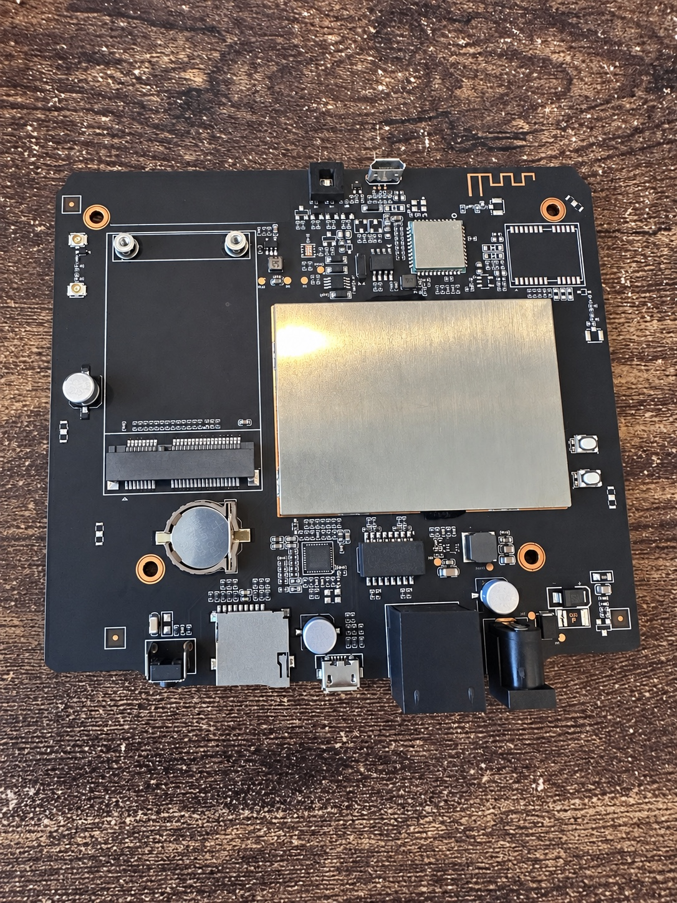

# 1. Install Armbian on a supported Bobcat Miner 300

Start with the model-specific images and instructions in the [Bobcat-Armbian project](https://github.com/sicXnull/Bobcat-Armbian). Bobcat revisions use different boot methods and device trees.



*Photograph of a Bobcat board with identifying labels and barcodes removed. Confirm the ports, board revision, and radio hardware on your own device.*

## Supported variants

The upstream project currently lists:

| Variant | Image | Boot method |
| --- | --- | --- |
| G280 | `BobcatArmbian280.img.xz` | Boots from microSD; no Wi-Fi listed upstream |
| G285 | `BobcatArmbian285.img.xz` | Boots from microSD |
| G290/G295 | `Bobcat29X_EMMC_Flasher.img` | Boots from SD and writes Armbian to internal eMMC |

If your model is not listed, do not guess. Confirm the correct image and boot method upstream first.

## Hardware checklist

- Bobcat Miner 300 G285
- 16 GB microSD card minimum
- 32 GB or larger high-endurance microSD card recommended
- computer with a microSD reader
- Ethernet or Wi-Fi network access

The LoRa concentrator is not required for the DNS appliance.

## Use the matching Armbian image

Download the appropriate file from the upstream [releases](https://github.com/sicXnull/Bobcat-Armbian/releases). G280/G285 SD images leave internal eMMC untouched. The G290/G295 flasher image overwrites internal eMMC, so follow the upstream instructions exactly and do not interrupt power during the flash.

## Flash the image

On macOS, Windows, or Linux, [balenaEtcher](https://etcher.balena.io/) is the simplest option: select the matching `.img.xz` image, select the SD card, flash it, and safely eject it.

Linux and macOS users can also write an extracted image from the terminal. Windows users should use a graphical image writer.

### macOS Terminal

```bash
xz -d BobcatArmbian285.img.xz
diskutil list
diskutil unmountDisk /dev/diskX
sudo dd if=BobcatArmbian285.img of=/dev/rdiskX bs=4m status=progress
sync
diskutil eject /dev/diskX
```

Replace `diskX` only after confirming it is the SD card.

### Linux Terminal

```bash
xz -d BobcatArmbian285.img.xz
lsblk
sudo umount /dev/sdX*
sudo dd if=BobcatArmbian285.img of=/dev/sdX bs=4M status=progress conv=fsync
sync
```

Replace `/dev/sdX` with the whole SD-card device, not a partition. Verify the device before running `dd`; it overwrites the selected disk.

Write the image to the microSD card, eject it cleanly, and place the card in the Bobcat.

## First boot

Power on the Bobcat and allow several minutes for the first boot.

Once the device is on the network, SSH into it using the address your router assigned:

```bash
ssh root@BOBCAT_LAN_IP
```

Replace `BOBCAT_LAN_IP` with the address shown by your router or DHCP server.

The image should identify itself as an Armbian/Debian ARM64 system for the matching Bobcat board. Exact kernel and Armbian versions change over time.

```text
Armbian ... for Bobcat ...
Linux ...-rockchip64
Debian ... userspace
```

## Confirm you are on the expected board and storage

```bash
hostnamectl
uname -a
lsblk
cat /proc/device-tree/model 2>/dev/null; echo
tr '\0' '\n' < /proc/device-tree/compatible 2>/dev/null
```

The device-tree model should identify the matching Bobcat board:

```text
Bobcat ...
```

The root filesystem was on the microSD card and the original internal eMMC remained present but untouched.

A typical SD-boot storage layout is:

```text
mmcblk0   ~29.7G   microSD / Armbian root
mmcblk1   ~57.6G   original internal eMMC
```

## Do not overwrite the internal eMMC unless you intend to

For a DNS appliance, running from microSD is sufficient and makes recovery easy. If the SD image becomes damaged, reflash a card and restore the configuration.

Do not run installation tools that copy the OS to internal eMMC unless you have verified exactly what they will overwrite.

## Protect the working kernel while setting up the appliance

On community Bobcat images, consider holding the working Rockchip kernel/U-Boot packages so a normal package upgrade does not unexpectedly change the boot stack:

```bash
sudo apt-mark hold \
  linux-image-current-rockchip64 \
  linux-dtb-current-rockchip64 \
  linux-u-boot-bobcat-29x-current
```

Check holds with:

```bash
apt-mark showhold
```

This is conservative. Remove a hold only when you deliberately want to test a kernel/device-tree/U-Boot update and have a recoverable SD-card image.

## Basic update

```bash
sudo apt update
sudo apt upgrade
```

Review the proposed upgrade before accepting it, especially on community images.

## Set the hostname

Use a generic hostname of your choice, for example:

```bash
sudo hostnamectl set-hostname dns-appliance
```

Confirm:

```bash
hostname
```

If networking is not working, use [02-networking.md](02-networking.md). Otherwise continue with [03-pihole-unbound.md](03-pihole-unbound.md).
