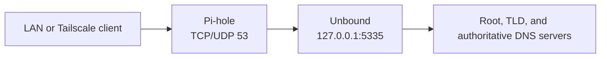

# 3. Install Pi-hole and Unbound

This is the core of the conversion. Pi-hole answers DNS requests from clients and applies filtering. Unbound runs locally on the Bobcat and performs recursive DNS resolution.

Final DNS path:

```text
client -> Pi-hole :53 -> Unbound 127.0.0.1:5335 -> DNS root/TLD/authoritative servers
```



## 1. Install Pi-hole

```bash
sudo apt update
sudo apt install -y curl dnsutils
curl -sSL https://install.pi-hole.net | bash
```

During setup:

- choose the active network interface;
- keep the Bobcat on its static/reserved IP;
- enable the web interface if desired;
- allow Pi-hole to install its normal blocklists;
- the temporary upstream DNS choice does not matter because we will replace it with Unbound.

Check:

```bash
pihole status
```

Pi-hole should report FTL listening on TCP and UDP port 53.

## 2. Install Unbound

```bash
sudo apt install -y unbound
sudo nano /etc/unbound/unbound.conf.d/pi-hole.conf
```

Use:

```text
server:
    verbosity: 0
    interface: 127.0.0.1
    port: 5335
    do-ip4: yes
    do-udp: yes
    do-tcp: yes
    do-ip6: no

    root-hints: "/var/lib/unbound/root.hints"

    harden-glue: yes
    harden-dnssec-stripped: yes
    use-caps-for-id: no
    edns-buffer-size: 1232

    prefetch: yes
    num-threads: 1
    so-rcvbuf: 1m

    private-address: 192.168.0.0/16
    private-address: 172.16.0.0/12
    private-address: 10.0.0.0/8
    private-address: 169.254.0.0/16
    private-address: fd00::/8
    private-address: fe80::/10
```

These are standard private address ranges, not installation-specific addresses. The important local-only settings are:

```text
interface: 127.0.0.1
port: 5335
```

## 3. Install/update root hints

```bash
sudo mkdir -p /var/lib/unbound
sudo curl -o /var/lib/unbound/root.hints https://www.internic.net/domain/named.root
sudo chown unbound:unbound /var/lib/unbound/root.hints
```

## 4. Validate and restart Unbound

```bash
sudo unbound-checkconf
sudo systemctl enable unbound
sudo systemctl restart unbound
systemctl status unbound --no-pager
```

Test Unbound directly:

```bash
dig @127.0.0.1 -p 5335 google.com
dig @127.0.0.1 -p 5335 dnssec.works +dnssec
```

A DNSSEC-validating response should include the `ad` flag.

## 5. Point Pi-hole at Unbound

Use Pi-hole's configuration CLI so values are validated and written in the format expected by Pi-hole v6. Do not edit `pihole.toml` by hand for these settings.

```bash
sudo cp /etc/pihole/pihole.toml /etc/pihole/pihole.toml.backup
sudo pihole-FTL --config dns.upstreams '[ "127.0.0.1#5335" ]'
```

Restart Pi-hole DNS:

```bash
sudo systemctl restart pihole-FTL
pihole status
```

## 6. Allow LAN and Tailscale clients

For Pi-hole v6, set the listening mode with the CLI:

```bash
sudo pihole-FTL --config dns.listeningMode "ALL"
```

Check the value:

```bash
pihole-FTL --config dns.upstreams
pihole-FTL --config dns.listeningMode
```

`ALL` permits DNS requests on all interfaces. Before using it, verify that the router has no TCP/UDP 53 port-forward and that the host firewall does not permit unwanted external access:

```bash
ss -lntup | grep -E '(:53 )'
sudo nft list ruleset
```

Use `ALL` only for a deliberately LAN/Tailscale-accessible appliance. Never port-forward public DNS traffic to the Bobcat.

## 7. Verify the complete chain

Replace `BOBCAT_LAN_IP` with your own Bobcat LAN address:

```bash
dig @BOBCAT_LAN_IP google.com +short
dig @BOBCAT_LAN_IP doubleclick.net +short
```

Expected behavior:

```text
google.com       -> normal public IP address
doubleclick.net  -> blocked response, commonly 0.0.0.0
```

Check sockets:

```bash
ss -lntup | grep -E '(:53 |:5335 )'
```

You want Pi-hole/FTL on port 53 and Unbound on `127.0.0.1:5335`.

## 8. Backup the working configuration

```bash
sudo cp /etc/unbound/unbound.conf.d/pi-hole.conf ~/pi-hole-unbound.conf.backup
```

Keep private backups of:

```text
/etc/pihole/pihole.toml
/etc/unbound/unbound.conf.d/pi-hole.conf
```

Do not commit generated backups that contain local hostnames, addresses, or other environment-specific values.

Continue with [04-tailscale.md](04-tailscale.md).
