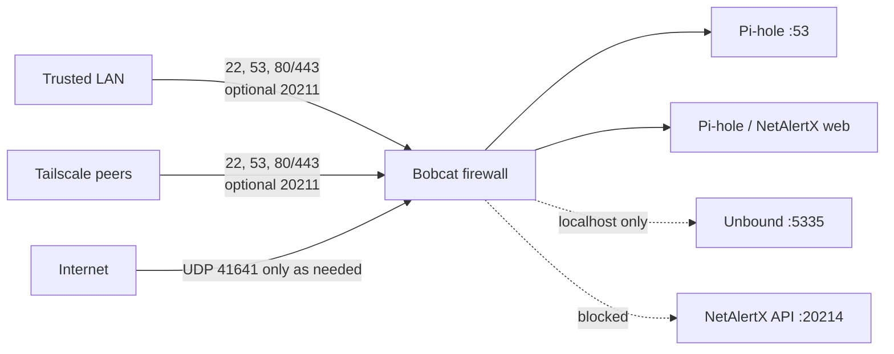

# 11. Security hardening

Apply this after the appliance is working and has passed the validation steps. The goal is to keep the services needed for DNS, administration, and optional monitoring while reducing unnecessary network exposure.

This guide intentionally uses generic placeholders. Do not publish real LAN addresses, hostnames, device identifiers, credentials, or private Tailscale information.

## 1. Review listening services

Before changing firewall rules, inspect what is listening:

```bash
ss -lntup
```

For the standard appliance, the expected service roles are:

```text
22/tcp          SSH administration
53/tcp+udp      Pi-hole DNS
80/tcp          Pi-hole web interface
443/tcp         Pi-hole web interface
5335/tcp+udp    Unbound, localhost only
41641/udp       Tailscale transport
20211/tcp       optional NetAlertX web interface
20214/tcp       optional NetAlertX internal API
```

Other listeners may be valid depending on the operating-system image, but unused services should be reviewed rather than left enabled automatically.

## 2. Disable rpcbind when it is not needed

A DNS appliance does not normally need RPC/NFS services. If port 111 is listening and the device is not being used as an NFS/RPC server, disable rpcbind:

```bash
sudo systemctl disable --now rpcbind.service rpcbind.socket
```

Verify:

```bash
systemctl is-active rpcbind.service rpcbind.socket 2>/dev/null || true
ss -lntup | grep ':111 ' || echo 'Port 111 is closed'
```

Do not disable rpcbind if you intentionally use this machine for services that require it.

## 3. Install a host firewall

Install UFW:

```bash
sudo apt update
sudo apt install -y ufw
```

Set a deny-by-default inbound policy while allowing normal outbound traffic:

```bash
sudo ufw default deny incoming
sudo ufw default allow outgoing
```

Allow traffic from the trusted home LAN. Replace `LAN_SUBNET` with the subnet used by your own network:

```bash
sudo ufw allow from LAN_SUBNET
```

Allow traffic arriving from Tailscale peers:

```bash
sudo ufw allow from 100.64.0.0/10
```

Allow Tailscale's WireGuard transport:

```bash
sudo ufw allow 41641/udp
```

Enable the firewall:

```bash
sudo ufw enable
sudo ufw status verbose
```

These rules intentionally allow trusted LAN and Tailscale peers to reach the appliance while denying unsolicited inbound traffic from other networks.

## 4. Tighten broad temporary rules

The broad LAN and Tailscale rules above are a safe starting point while you confirm the appliance works. After validation, replace them with service-specific rules. Keep the SSH rule before deleting broad access, and replace the placeholders first:

```bash
LAN_INTERFACE="LAN_INTERFACE"
LAN_SUBNET="LAN_SUBNET"

sudo ufw allow in on "$LAN_INTERFACE" from "$LAN_SUBNET" to any port 22 proto tcp
sudo ufw allow in on "$LAN_INTERFACE" from "$LAN_SUBNET" to any port 53 proto tcp
sudo ufw allow in on "$LAN_INTERFACE" from "$LAN_SUBNET" to any port 53 proto udp
sudo ufw allow in on "$LAN_INTERFACE" from "$LAN_SUBNET" to any port 80 proto tcp
sudo ufw allow in on "$LAN_INTERFACE" from "$LAN_SUBNET" to any port 443 proto tcp

sudo ufw allow in on tailscale0 to any port 22 proto tcp
sudo ufw allow in on tailscale0 to any port 53 proto tcp
sudo ufw allow in on tailscale0 to any port 53 proto udp
sudo ufw allow in on tailscale0 to any port 80 proto tcp
sudo ufw allow in on tailscale0 to any port 443 proto tcp
```

If NetAlertX is installed, also allow only its web interface—not its internal API—from trusted networks:

```bash
sudo ufw allow in on "$LAN_INTERFACE" from "$LAN_SUBNET" to any port 20211 proto tcp
sudo ufw allow in on tailscale0 to any port 20211 proto tcp
```

Remove the broad rules only after the specific rules are present:

```bash
sudo ufw delete allow from "$LAN_SUBNET"
sudo ufw delete allow from 100.64.0.0/10
sudo ufw status numbered
```

Port `20214` is NetAlertX's internal API and should not be allowed to LAN, Tailscale, or internet clients. Local NetAlertX components can continue to use it.

## 5. Why Pi-hole and Unbound still work

The intended DNS path remains:

```text
LAN or Tailscale client
        |
        v
Pi-hole :53
        |
        v
Unbound 127.0.0.1:5335
        |
        v
DNS hierarchy
```

Pi-hole can listen for trusted LAN and Tailscale clients, while Unbound remains reachable only from the local machine.

Verify Unbound is still bound only to localhost:

```bash
ss -lntup | grep ':5335 '
grep -RniE '^[[:space:]]*(interface|port):' /etc/unbound/unbound.conf /etc/unbound/unbound.conf.d 2>/dev/null
```

The expected interface is:

```text
127.0.0.1:5335
```

## 6. Verify Pi-hole exposure

Pi-hole may use `listeningMode = "ALL"` when the appliance must answer DNS on both the LAN interface and Tailscale. This is acceptable only when network exposure is controlled by the host firewall and router.

Check the setting with Pi-hole's CLI:

```bash
pihole-FTL --config dns.listeningMode
```

Do not expose TCP or UDP port 53 directly to the public internet.

## 7. Check Tailscale routing behavior

A normal DNS appliance does not need to advertise LAN routes or act as an exit node.

Check:

```bash
tailscale debug prefs 2>/dev/null | grep -E '"(AdvertiseRoutes|ExitNodeID|CorpDNS|RunSSH)"' || true
```

Only enable subnet routing, exit-node behavior, or Tailscale SSH if you deliberately want those features.

## 8. Check the router

The router remains an important security boundary. Verify that it does not forward appliance service ports from the public internet unless that exposure is intentional and separately secured.

For this appliance, there is normally no reason to create public port forwards for:

```text
22      SSH
53      DNS
80      Pi-hole web
443     Pi-hole web
20211   NetAlertX web
20214   NetAlertX internal API
```

Remote access should use Tailscale instead of public port forwarding.

The host cannot verify router configuration. Confirm in the router that there is no port forward or DMZ/exposed-host rule targeting the Bobcat. The intended internet-facing exception is normal Tailscale UDP transport; DNS, SSH, Pi-hole, and NetAlertX should not be forwarded.

## 9. Validate after enabling the firewall

Test Unbound locally:

```bash
dig @127.0.0.1 -p 5335 google.com +short
```

Test Pi-hole on the LAN:

```bash
dig @BOBCAT_LAN_IP google.com +short
dig @BOBCAT_LAN_IP doubleclick.net +short
```

If Tailscale is enabled, test through the current Tailscale address:

```bash
TS_IP="$(tailscale ip -4)"
dig @"$TS_IP" google.com +short
dig @"$TS_IP" doubleclick.net +short
```

Confirm the firewall and active listeners:

```bash
sudo ufw status verbose
ss -lntup
```

If all tests pass, the DNS chain is still working while unnecessary inbound exposure is reduced.

## 10. Expected final exposure

After the firewall and router checks are complete, the intended exposure is:

| Service | LAN | Tailscale | Internet |
| --- | --- | --- | --- |
| SSH, TCP 22 | trusted only | trusted only | blocked |
| Pi-hole, TCP/UDP 53 | allowed | allowed | blocked |
| Pi-hole web, TCP 80/443 | allowed | allowed | blocked |
| NetAlertX web, TCP 20211 | optional, trusted only | optional, trusted only | blocked |
| Unbound, TCP/UDP 5335 | localhost only | blocked | blocked |
| NetAlertX API, TCP 20214 | blocked | blocked | blocked |
| Tailscale transport, UDP 41641 | n/a | n/a | allowed as needed |

There should be no unsolicited public inbound access to the appliance services.



## 11. Ongoing security checks

Periodically review:

```bash
sudo ufw status verbose
ss -lntup
systemctl --failed
docker ps
```

Keep the operating system and applications updated, review changes before upgrading the community boot stack, and keep private configuration backups outside the public repository.
